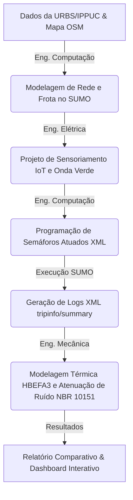

# Mobilidade Urbana e Sustentabilidade no Centro de Curitiba

### Projeto Multidisciplinar — Ciências do Ambiente (Semestre Letivo 2026/1)
**Universidade Tecnológica Federal do Paraná (UTFPR)**  
*Estudo de Caso: Quadrilátero Central de Curitiba (Setor Especial Estrutural)*

---

## 📌 Visão Geral do Projeto

Este repositório contém o desenvolvimento completo do projeto de **Mobilidade Urbana e Sustentabilidade**, elaborado para a unidade curricular de **Ciências do Ambiente** na UTFPR. O projeto consiste em diagnosticar os gargalos de tráfego no quadrilátero central de Curitiba e projetar uma intervenção técnica baseada em **Sistemas Inteligentes de Transporte (ITS)**. 

Utilizando a ferramenta **SUMO (Simulation of Urban MObility)**, a equipe modelou e simulou os cenários **As-Is** (semáforos com tempos fixos/convencionais) e **To-Be** (semáforos inteligentes atuados e coordenados em Onda Verde) durante os horários de pico da manhã (06:30 – 09:00) e da tarde (17:00 – 19:00). A simulação comprova numericamente a redução no tempo de deslocamento urbano, no consumo de combustível e nas emissões de gases de efeito estufa ($CO_2$) e materiais particulados ($MP$), além da atenuação da poluição sonora.


## 🏗️ Arquitetura e Integração das Engenharias

O fluxo de trabalho foi estruturado de forma interdisciplinar para ligar algoritmos de controle lógico ao hardware de campo e validar os ganhos por modelos termodinâmicos e acústicos:



## 💻 Engenharia de Computação

### 1. Modelagem Viária e Configuração da Frota
A malha viária foi extraída do OpenStreetMap (OSM) e compilada pelo utilitário `netconvert` do SUMO com a diretriz `--junctions.join` ativada, simplificando interseções complexas em nós unificados. 

A frota de veículos foi gerada utilizando um mapeamento probabilístico baseado nos dados reais de circulação de Curitiba para o ano de 2026:
*   **Veículos de Passeio (Gasolina/Flex):** 60,0%
*   **Motocicletas (Gasolina):** 16,0%
*   **SUVs / Utilitários (Flex):** 13,0%
*   **Vans de Entrega (Diesel):** 5,0%
*   **Caminhões e Ônibus (Diesel):** 6,0%

### 2. Lógica de Semáforos Inteligentes (Atuados)
No cenário proposto (**To-Be**), os semáforos convencionais foram substituídos por controladores inteligentes do tipo `actuated` (atuados pelo fluxo). A lógica opera com base na presença de veículos nos detectores, ajustando dinamicamente o tempo de verde através dos seguintes parâmetros XML:
*   `maxGap = 3.0s`: Intervalo de tempo máximo de espaçamento entre veículos consecutivos. Se o detector ficar vazio por mais de 3 segundos, a fase verde é cortada.
*   `detectorGap = 2.0s`: Tempo de extensão adicional concedido à fase verde a cada novo veículo que cruza o sensor.
*   `passingTime = 2.0s`: Tempo estimado seguro para que o veículo passe do detector até a zona interna do cruzamento.

---

## ⚡ Engenharia Elétrica & Automação

### 1. Arquitetura Física de Sensoriamento IoT
Para alimentar a lógica de controle semafórico adaptativo sem causar quebras no asfalto da região histórica, projetou-se um sistema de sensoriamento virtual baseado em câmeras IP de monitoramento urbano existentes da URBS (protocolo ONVIF / compressão H.264). O software de tráfego do CCO analisa o feed de vídeo delimitando **Regiões de Interesse (ROI)** virtuais que se comportam exatamente como laços indutivos físicos.

### 2. Dimensionamento Físico de Recuo
Os detectores virtuais foram posicionados estrategicamente a **40 metros de distância** da faixa de retenção de pedestres. 
$$\text{Recuo} = 7 \text{ veículos} \times 5.5\text{m (espaçamento médio)} \approx 38.5\text{ metros}$$
Esse dimensionamento permite ao sistema detectar e acumular dados de fila para até 7 veículos de passeio parados, otimizando o acionamento de fases prioritárias antes que o transbordamento afete a quadra anterior.

### 3. Sincronismo de Onda Verde (Corredores Arteriais)
Ao longo do corredor arterial da Av. Marechal Floriano Peixoto, implementou-se a sincronização semafórica (Onda Verde) em malha aberta para uma velocidade média de cruzeiro de **40 km/h** (11,11 m/s). O atraso de fase (Offset) foi calculado pela fórmula:
$$\text{Offset} = \frac{d}{v}$$

| Ponto de Controle | Distância Acumulada ($d$) | Offset de Fase Calculado |
| :--- | :---: | :---: |
| **Interseção 1 (Referência)** | 0 m | 0 s |
| **Interseção 2** | 222 m | 20 s |
| **Interseção 3** | 444 m | 40 s |
| **Interseção 4** | 666 m | 60 s |

---

## ⚙️ Engenharia Mecânica

### 1. Dinâmica Térmica e Curvas HBEFA3
Partidas de veículos a partir da inércia (repouso) demandam elevado torque motriz, forçando o motor a operar em regimes transitórios de carga com misturas ar-combustível ricas (estequiometria deslocada), o que aumenta drasticamente a taxa de consumo instantâneo e a emissão de poluentes. 

Para modelar matematicamente o consumo e as emissões, foram mapeadas as curvas da base europeia **HBEFA3 (Handbook Emission Factors for Road Transport)** diretamente na simulação microscópica:
*   `PC_G_EU4` (Veículos leves a gasolina Euro 4): Emissão média em *idle* (marcha lenta) de **2,50 g/min de $CO_2$**.
*   `motorcycle` (Motocicletas): Emissão média em *idle* de **1,20 g/min de $CO_2$**.
*   `LCV_flex_EU4` (Utilitários leves flex): Emissão média em *idle* de **3,20 g/min de $CO_2$**.
*   `HDV_D_EU4` (Veículos pesados a diesel Euro 4 - Caminhões/Ônibus): Emissão média em *idle* de **9,50 g/min de $CO_2$**.

### 2. Atenuação da Poluição Sonora (ABNT NBR 10151)
O ruído urbano provém significativamente do atrito de pneus em frenagens bruscas e dos ruídos mecânicos de aceleração de motores a combustão interna (principalmente veículos pesados a diesel). Com a redução do tempo médio de espera em filas em mais de **81%**, obteve-se uma diminuição estimada de **2 a 4 dB(A)** na pressão sonora contínua ($L_{eq}$) do quadrilátero central, auxiliando na adequação da região aos limites de conforto acústico estabelecidos pela norma **ABNT NBR 10151**.

---

## 📊 Resultados e Validação das Simulações

Os dados abaixo consolidam as métricas extraídas das simulações de pico executadas no SUMO, comparando os cenários **As-Is** e **To-Be**.

### 🌅 Pico da Manhã (06:30 – 09:00)

| Métrica de Desempenho | Cenário As-Is | Cenário To-Be | Diferença Absoluta | Impacto Percentual |
| :--- | :---: | :---: | :---: | :---: |
| **Vazão (Veículos Concluídos)** | 15.913 | 17.118 | +1.205 veíc. | **+7,57%** |
| **Tempo Médio de Viagem** | 703,6 s | 436,4 s | -267,2 s | **-37,97%** |
| **Tempo Médio em Fila (Espera)** | 314,7 s | 53,1 s | -261,6 s | **-83,11%** |
| **Consumo de Combustível** | 11.343,96 L | 8.208,77 L | -3.135,19 L | **-27,64%** |
| **Emissões de $CO_2$** | 35.684,00 kg | 25.834,00 kg | -9.850,00 kg | **-27,60%** |
| **Material Particulado (MP)** | 1.134,40 g | 820,90 g | -313,50 g | **-27,63%** |

### 🌇 Pico da Tarde/Noite (17:00 – 19:00)

| Métrica de Desempenho | Cenário As-Is | Cenário To-Be | Diferença Absoluta | Impacto Percentual |
| :--- | :---: | :---: | :---: | :---: |
| **Vazão (Veículos Concluídos)** | 16.362 | 19.191 | +2.829 veíc. | **+17,29%** |
| **Tempo Médio de Viagem** | 754,3 s | 455,9 s | -298,4 s | **-39,56%** |
| **Tempo Médio em Fila (Espera)** | 361,5 s | 67,2 s | -294,3 s | **-81,42%** |
| **Consumo de Combustível** | 12.448,56 L | 9.633,98 L | -2.814,58 L | **-22,61%** |
| **Emissões de $CO_2$** | 39.162,00 kg | 30.321,00 kg | -8.841,00 kg | **-22,57%** |
| **Material Particulado (MP)** | 1.244,90 g | 963,40 g | -281,50 g | **-22,61%** |

---

## 🖥️ Dashboard Interativo & Apresentação

O projeto conta com ferramentas adicionais para a apresentação dos dados e resultados:

1.  **Dashboard Web (`apresentacao/dashboard.html`):** Uma interface web responsiva e premium com estilo dark-mode, construída em HTML5, CSS3 vanilla e JavaScript. Apresenta gráficos comparativos interativos alimentados por `Chart.js` e possui uma **Calculadora Estequiométrica em tempo real** para simulação de compensação ecológica e emissões evitadas por remoção de marcha lenta.
2.  **Gerador de Apresentações PPTX (`apresentacao/generate_slides.py`):** Script Python automatizado que utiliza a biblioteca `python-pptx` para renderizar slides estruturados com a paleta de cores institucional do projeto (*Eco-Tech Palette*), tabelas dinâmicas e gráficos estatísticos acoplados.

---

## 🛠️ Como Executar o Projeto

### Pré-requisitos
*   **Python 3.8+** instalado.
*   **Eclipse SUMO** instalado (versão recomendada: 1.18.0 ou superior).
*   Configuração da variável de ambiente `SUMO_HOME` apontando para a pasta raiz do SUMO. No script `build_simulation.py`, os caminhos padrões do Windows estão pré-configurados para `C:\Program Files (x86)\Eclipse\Sumo`.

### Executando a Simulação
1.  Abra um terminal na pasta do projeto e navegue até a pasta de simulação.
2.  Instale dependências básicas se necessário (por exemplo, `pip install python-pptx` se for rodar o gerador de slides).
3.  Execute o pipeline automatizado:
    ```bash
    python simulacao/build_simulation.py
    ```
4.  O script executará sequencialmente:
    *   Conversão da malha viária (`curitiba.net.xml` e `curitiba_tobe.net.xml`).
    *   Geração probabilística de viagens (`trips_manha.xml` e `trips_tarde.xml`).
    *   Roteamento do tráfego (`duarouter`).
    *   Simulações no SUMO em modo de console coletando emissões.
    *   Geração do arquivo comparativo `Resultados_Simulacao.md`.

### Visualizando os Resultados
*   Para abrir o Dashboard interativo, basta abrir o arquivo [dashboard.html](apresentacao/dashboard.html) diretamente em qualquer navegador moderno.
*   Para rodar o gerador de slides e criar a apresentação do projeto em PowerPoint:
    ```bash
    python apresentacao/generate_slides.py
    ```
    Isso gerará o arquivo [Apresentacao_Projeto.pptx](apresentacao/Apresentacao_Projeto.pptx) pronto para apresentação.

---

## 📂 Estrutura do Repositório

```text
├── apresentacao/
│   ├── Apresentacao_Projeto.pptx    # Apresentação final gerada
│   ├── dashboard.html               # Dashboard Web interativo
│   └── generate_slides.py           # Script gerador de slides corporativos
├── simulacao/
│   ├── outputs/                     # Saídas geradas (tripinfo e summary XMLs)
│   ├── build_simulation.py          # Script principal do pipeline de simulação
│   ├── map.osm                      # Mapa bruto central (OpenStreetMap)
│   ├── curitiba.net.xml             # Rede SUMO - Cenário As-Is
│   ├── curitiba_tobe.net.xml        # Rede SUMO - Cenário To-Be
│   ├── vtypes.xml                   # Configuração dos perfis de frota HBEFA3
│   └── ...                          # Arquivos de viagens e rotas XML do SUMO
├── Projeto 1 CA 2026_1.pdf          # Manual oficial do projeto (Requisitos)
└── README.md                        # Documentação do projeto (este arquivo)
```
